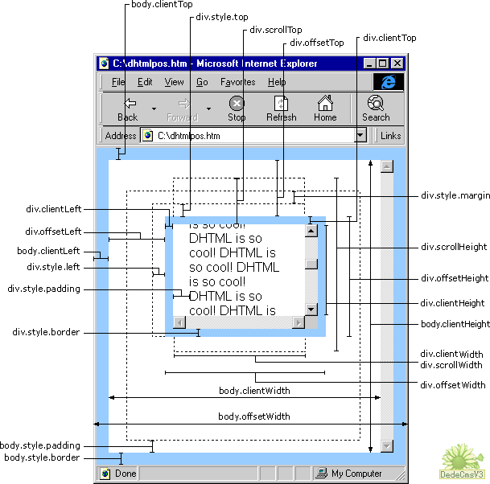

# DOM & BOM

dom对象和bom对象总结


## table of contents

[TOC]


## DOM 

document object model


### HTMLCollection && nodeList

#### similiarty:

* 都是类数组，都有length属性

* 都有getter， list.item(0) 或 list[0]

* 都是动态的， 其内元素变化会反映到其自身

#### difference:

* nodeList 保存的是node( 包含含空节点，文本节点, 注释等)，HTMLCollection 保存的是 element（element继承node，不含其他元素， 只有element元素nodetype 为 1）

* HTMLCollection有个nameItem() 方法，可以返回集合中name属性和id属性值的元素。

 

### Node attribute 

| attribute | Intro                                  | demo                                                         |
| ------------------------ | -------------------------------------- | ------------------------------------------------------------ |
| someNode.**nodeType**   | 节点类型（1 - 12）                     | 1 为 元素element，3 为文本，11 位文档片段documentFregment |
| someNode.nodeName        | 节点标签名                             | 'p', 'div' , someNode.tagName                           |
| someNode.nodeValue       | 节点值                                 |                                                              |
| someNode.**childNodes**  | 节点的子节点类数组，保存着一个nodeList | someNode.childNodes[0]<br>someNode.childNodes.item(1)<br>Array.prototype.slice.call(childNodes, 0) |
| someNode.**children** | 返回子节点中还是元素的集合(nodetype为1),是HTMLCollection的实例 | someNode.children[0] |
| someNode.hasChildNodes() | 子节点是否含有childNodes | someNode.childNodes.length === 0 |
| someNode.**parentNode**  | 节点的父节点，所有子节点拥有同一父节点 |                                                              |
| someNode.previousSibling | 节点的兄弟节点（相邻的上一个节点）     |                                                              |
| someNode.nextSibling     | 节点的兄弟节点（相邻的下一个节点）     |                                                              |
| someNode.firstChild | 节点的第一个子节点, 可能是文本，注释， 空节点等 |                                                              |
| someNode.lastChild | 节点的最后一个子节点 | |
| someNode.firstElementChild | 节点的第一个元素节点 | |
| someNode.lastElementChild | 节点的最后一个元素节点 | |
| someNode.previousElementSibling | 节点的兄弟节点（相邻的上一个元素节点） | |
| someNode.nextElementSibling | 节点的兄弟节点（相邻的下一个元素节点） | |
| someNode.childElementCount | 返回子元素（nodeType = 1）节点个数 |  |
| **someNode.dataset** | 返回当前元素的**自定义属性集** | `<div data-myrule="123"></div>`    div.dataset.myrule // return '123' |


### Node method

| method                               | Intro                                                        | Demo                                                         |
| ------------------------------------ | ------------------------------------------------------------ | ------------------------------------------------------------ |
| **someNode.appendChild(A)**          | 在someNode的nodeList末尾添加一个A                            |                                                              |
| **someNode.insertBefore(A, B)**      | 在参照节点（B）前添加一个A 节点, 若第二个参数是 null , 则执行与 appendChild 相同操作 |                                                              |
| **someNode.replaceChild(new,old)**   | 用new节点替换 old节点，old为someNode的子节点                 | someNode.replaceChild(node, someNode.firstChild)             |
| **someNode.removeChild(A)**          | 移除someNode下的某个子节点A                                  | A.removeChild(A.firstChild)                                  |
| **someNode.cloneNode(boolean)**      | 复制节点 ，boolean 为 true 执行深复制， boolean 为 false 执行浅复制(只复制当前元素，不复制子元素)。执行复制之后的节点没有父节点，成了孤儿，必须通过以上集中操作才能显示。 | const deepNode  = someNode.cloneNode(true)  deepNode.length // 3                        const shallowNode = someNode.cloneNode(false)   shallowNode.length // 0 |
| someNode.machesSelector(cssSelector) | 接收一个css选择符作为参数，返回                              | el.machesSelector('body.label') // => true or false          |


### document 

| Attr & method                        | Intro                                                 | Demo                                                         |
| ------------------------------------ | ----------------------------------------------------- | ------------------------------------------------------------ |
| document.documentElement             | 取得对<html>元素的引用                                | document.documentElement === document.childNodes[0] === document.firstChild |
| document.title                       | 获取/设置文档标题                                     | document.title // 获取titile                                                document.title = 'epic doc' // 设置title |
| document.URL                         | 获取页面完整的url（不可设置）                         | https://cn.demo.com/search?q=1234                            |
| document.domain                      | 获取/设置页面的域名，只能设置其站点的子域名           | document.domain // https://cn.demo.com    document.domain = 'demo.com' // success    document.domain = 'baidu.com' // failed |
| document.referrer                    | 获取跳转到当前页面的那个页面的url                     |                                                              |
| document.getElementById()            |                                                       |                                                              |
| document.getElementsByTagName()      | 返回一个HTMLCollection,有个方法nameItem()             | const list = document.getElementsByTagName('p');       list.nameItem('myName') // 返回这个htmlCollection 中name为myName的元素 |
| document.getElementsByName()         | 返回一个HTMLCollection                                |                                                              |
| document.anchors                     | 返回一个HTMLCollection，包含所有带name属性的<a>元素   |                                                              |
| document.forms                       | 返回所有<form>元素                                    |                                                              |
| document.images                      | 返回所有元素                                     |                                                              |
| document.links                       | 返回所有带href属性的<a>元素                           |                                                              |
| document.open()                      |                                                       |                                                              |
| docuement.close()                    |                                                       |                                                              |
| **document.createElement(tagName)**  | 创建元素                                              | document.createElement('div')                                |
| document.createTextNode(string)      | 创建文本节点                                          | document.createTextNode('hello world')                       |
| **doc.createDocumentFragment()**     | 创建轻量级文档，继承document的所有属性。              | const fregment = document.createDocumentFragment();  for( let i = 0; i < 3; i++) { let li = document.createElement('li'); fregment.appendChild(li)} |
| document.querySelector()             | 返回第一个匹配的节点                                  |                                                              |
| document.querySelectorAll()          | 返回所有匹配的节点， 是一个nodeList快照，不会动态刷新 |                                                              |
| doc.getElementsByClassName(classStr) | 参数传入类名字符串，多个类名用空格隔开                | document.getElementByClassName ('sidebar content green')     |


### element

* **Nodetype 为 1** (important)
* nodevalue为 null

| attr && method       | Intro                | demo                                 |
| -------------------- | -------------------- | ------------------------------------ |
| el.nodeName          | 返回元素标签名(大写) | el.nodeName === el.tagName === 'DIV' |
| el.tagName           | 返回元素标签名(大写) |                                      |
| el.id                | 返回元素的id         |                                      |
| el.className         | 返回元素的类名字符串，多个类名用空格隔开 |                                      |
| **el.classList** | 返回一个具有length属性的DOMTokenList的实例,具有item(), add(), contains(), remove(), toggle() 方法 | **el.classList.add(val)** //添加 **el.classList.contains(val)**  // 判断<br/>**el.classList.remove(val)**        // 删除<br/>**el.classList.toggle(val)** // 切换 |
| el.title             | 返回元素的标题       |                                      |
| **el.style** | 返回 一个 以object 表示的css描述, 属性转换为驼峰命名法,例如: background-color => style.backgroundColor = 'red' | el.style // => {color: '#fff'}                 el.getAttribute('style') // => 'color: ...' |
| **el.getAttribute(attrName)** | 返回属性字符串表示 |                                      |
| **el.setAttribute(attrName, attrValue)** | 设置属性 |                                      |
| **el.removeAttribute(attrname)** | 移除属性 |                                      |
| **el.contains(A)** | 判断节点A是否是el的子节点,返回true,false |  |
| **el.scrollIntoView(true/false)** | 使元素出现在视窗内 | |
| el.scrollByLines(lineCount) | 使元素滚动指定的行数,lineCount 可以是正负值     **non-standard** | |
| el.scrollByPages(pageCount) | 使元素滚动指定的页数,pageCount 可以是正负值    **non-standard** | |


### dynamic script && style

```js
// dynamic script

function dynamicScript(url) {
    let script = document.createElement('script')
    script.type = 'text/javascript'
    script.src = url
    document.body.appendChild(script)
}

function dynamicScriptWithText(text) {
    let script = document.createElement('script')
    script.type = 'text/javascript'
    let textNode = document.createTextNode(text)
    script.appendChild(textNode)
    document.body.appendChild(script)
}

// dynamic style 
function dynamicStyle(url) {
    let link = document.createElement('link')
    link.type = 'text/css'
    link.rel = 'stylesheet'
    link.href = url
    document.head.appendChild(link)
}
```


### html translation

| 显示 | 说明           | 实体名称 | 实体编号 |
| ---- | -------------- | -------- | -------- |
|      | 半方大的空白   | & ensp; | &#8194;  |
|      | 全方大的空白   | & emsp; | &#8195;  |
|      | 不断行的空白格 | & nbsp; | &#160;   |
| <    | 小于           | & lt ; | &#60;    |
| >    | 大于           | & gt ;   | &#62;    |
| &    | &符号          | & amp ;  | &#38;    |
| "    | 双引号         | & quot;  | &#34;    |
| ©    | 版权           | & copy;  | &#169;   |
| ®    | 已注册商标     | & reg;   | &#174;   |
| ™    | 商标（美国）   | ™        | &#8482;  |
| ×    | 乘号           | & times; | &#215;   |
| ÷    | 除号           | & divide; | &#247;   |

```html
<input id="user[name]" />

// 转义特殊css字符用双反斜杠 '\\'
<script>
	document.querySelector('user[name]')  // null
  	document.querySelector('user\\[name\\]') // <input id="user[name]" />
</script>
```


### dom size

* **window.innerHeight**  

  > 浏览器视窗内高度（当前页面 ，不包括外层iframe）

* **window.innerWidth**  

  > 浏览器内宽度

* **div.offsetHeight** 

  > 元素在垂直方向占用的空间大小（单位-像素）

* **div.offsetWidth**    

  > 元素在水平方向占用空间大小（单位-像素）

* **div.offsetLeft**  

  > 元素的左外边框至包含元素的左内边框之间的像素距离

* **div.scrollLeft**     

  > 既可以确定元素当前滚动状态，又可以设置元素的**滚动位置**





## BOM

bowser object model


### location

浏览器导航对象

####location attribute

* **Location.href**

  > 读取/设置当前window的url

  ```js
  window.location === window.document.location
  ```

* **location.search**

  > 读取/设置当前url的搜索字符串

* **Location.hash**

  > 读取/设置当前url的hash

#### location method

* **location.reload()**

  > 刷新当前页面

* **Location.assign(href)**

  > 设置当前页面url, 浏览器可产生历史记录, 后退按钮可点击回到上一页

* **Location.replace(href)** 

  > 设置当前页面url, 浏览器不产生历史记录

