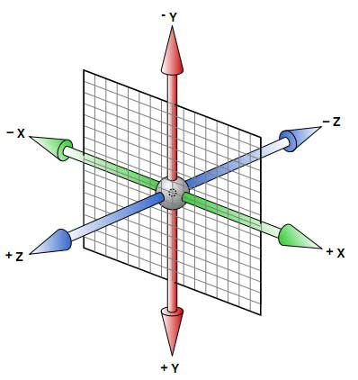

# css

Learn css and make pages pretty


### catalogue

[TOC]

### design principle

> 1. 移动优先原则，及默认的css样式为移动样式，然后通过媒体查询 用 桌面样式覆盖
> 2. 整体字体在 14px 到 20px 之间
> 3. 保持适当行距（1.5倍）
> 4. 段落采用缩进或隔行，不能两者同时用，首段不用隔行或缩进


#### font-face


```css
/* 定义字体 */
@font-face {
    font-family: 'myfont'; /* 自定义名 */
    src: url('myfont.woff') format('woff')  /* 路径，格式 */
}

/* 定义字体多种形态 */
@font-face {
  font-family: 'Roboto';
  src: url('Roboto-Light-webfont.woff') format('woff');
  font-style: normal;
  font-weight: 300;
}

@font-face {
  font-family: 'Roboto';
  src: url('Roboto-LightItalic-webfont.woff') format('woff');
  font-style: italic;
  font-weight: 300;
}

@font-face {
  font-family: 'Roboto';
  src: url('Roboto-Bold-webfont.woff') format('woff');
  font-style: normal;
  font-weight: 700;
}

/* 使用字体 */

.use {
    font-family: 'Robot';
}
```


#### responsive img

```html
<!-- 在retina 屏上加载standard-big.png图片, 标准屏幕加载standard.png图片, 老旧浏览器不支持srcset则加载src属性 -->


<!-- 告知浏览器photo-big.jpg 2000px宽, photo-small.jpg 1000px宽，屏幕宽度大于960px以960px加载photo-big.jpg, 其他情况下以100%的宽度加载photo-small.jpg  -->

<!-- 在移动设备和宽屏设备加载不同的图片 -->

<picture>
  <source media='(min-width: 401px)'
          srcset='images/photo-big.jpg'/>
  <source media='(max-width: 400px)'
          srcset='images/photo-tall.jpg'/>
  
</picture>
```


#### css selector

```css
/* 选择前面有 <p> 元素的每个 <ul> 元素。 */
p~ul

/* pseudo-class */

/* 访问过且鼠标滑过的链接 */
a:visited:hover {
    color: red;
}

/* 选择.container 的第一个p元素 */
.container p:first-of-type {
    
}

/* 选择.container 的最后一个p元素 */
.container p:last-of-type {
    
}

/* 属性选择器  class以foundicon- 开头的的元素 */
[class*="foundicon-"] {
    
}
```


#### BFC(block formating context)

```css
/* 创建bfc
	float: 值不为none;
	position: 值不为static或relative;
	overflow: 值不为visible;
	display: 值为 table-cell, table-caption, inline-block, flex, inline-flex
*/

/* 最常用方法 */
overflow: hidden;

```

#### BFC的应用

1.解决margin重叠（为每个带有margin的块包裹一个新的bfc）

2.解决浮动元素无法撑开父元素的高度（给包父元素设置为bfc）

3.解决文字环绕浮动元素（给包含文字的元素设置bfc）


#### media queries

```css
@media only screen and (min-width: 401px) and (max-width: 960px) {
    #main {
        ...
    }
}
```


#### FLOAT layout

1. clear: left; 排除 当前元素之前 float: left;元素对此元素的影响， 但之前元素的float: left仍对自身有效；
2. 如果一个父元素中有浮动元素，若让子元素撑开父元素的高度，方法一：在父元素末尾添加clear: both;的元素。方法二：在父元素增加 overflow: hidden;属性。


#### FLEX布局（flexible弹性布局） 

[demo1](https://codepen.io/zexiplus/pen/ELppKb) [demo2](https://codepen.io/zexiplus/pen/wjxbEN)

```css
display: flex;
display: inline-flex;
display: -webkit-flex; /* Safari */
/* 注：容器设置为flex后，子元素自动成为容器成员， 子元素的float, clear, vertical-align 都将失效 */

/* 容器上的5个属性 */

/* 排列方向 */
flex-direction: row | row-reverse | column | column-reverse;
/* 当flex-direction 从 row 变为 column 时，justify-content 的意义变为 align-items */

/* 换行规则  */
flex-wrap: nowrap | wrap | wrap-reverse;
/* nowrap ： 不换行，所有item排列成一排，width ： 100% 被忽略 */
/* wrap ： 换行显示 */

/* 水平对齐规则 */ 
justify-content: flex-start | flex-end | center | space-between | space-around;
/* space-between: 等间隔排列 第一项前无间隔 */
/* space-around : 等间隔排列 第一项前有间隔 */

/* 垂直对齐规则 */
align-items: flex-start | flex-end | center | baseline | stretch;
/* stretch: flex-item 被纵向拉伸至flex-contanier 一样的高度 */

/* 多轴对其规则 */
align-content: flex-start | flex-end | center | space-between | space-around | stretch;


/* 子属性 */

/* 宽度倍数 flex */
flex: initial; /* 原始宽度 */
flex: 1; /* 单位宽度（若其他item没设置，则被拉伸填满）*/
flex: 2; /* 单位宽度的两倍 */

/* 排列顺序 default 0 用此属性改变排列顺序 */
order: <integer>; 

/* 如果存在剩余空间， 放大的倍数 */
flex-grow: <number>; /* default 0 */

/* 如果空间不足， 缩小 */
flex-shrink: <number>; /* default 1 */

/* 属性定义了在分配多余空间之前，项目占据的主轴空间（main size） */
flex-basis: <length> | auto; /* default auto */

/* align-self属性允许单个项目有与其他项目不一样的对齐方式，可覆盖align-items属性。 */
align-self: auto | flex-start | flex-end | center | baseline | stretch;

/* 其他 */
margin-left: auto; /* 会把item撑到右侧 */
```


#### css-transition

```css
/* transition */
.trans {
    transition: all 1s ease-out;
}
```


#### css3-3D

[demo-cube](https://codepen.io/zexiplus/pen/NMOVrX)

```css
/* 父元素设置之后，其后代元素便会有3d效果 */
.container {
    trnasform-style: preserve-3d; 
}

.container {
    perspective: 300px;  // 景深  
    perspective-origin: 0px 0px; // 视角起始点
}

.trans {
   transform: translate3d(10px, 10px, 10px) | translateX(30px) | translateY(30px) | 		      translateZ(30px);
   transform: rotateX(90deg) | rotateY(90deg) | rotateZ(90deg);
   transform: scale3d(1, 1, 1) | scaleX(1.2) | scaleY(1.2) |  scaleZ(1.2);
}
```




#### css: filter滤镜(组合能达到神奇的效果)

```css
// 灰度
.grayscale {
    filter: grayscale(1) // 0~1 代表灰度
}

// 褐色
.sepia {
    filter: sepia(.5)
}

// 饱和度
.saturate {
    filter: saturate(5)
}

// 色相旋转 
.hue-rotate {
    filter: hue-rotate(90deg)
}

// 反色
.invert {
    filter: invert(1)
}

// 透明度
.opacity {
    filter: opacity(.5)
}

// 亮度
.brightness {
    filter: brightness(2)
}

// 对比度
.contrast {
    filter: contrast(.4)
}

// 模糊
.blur {
    filter: blur(10px)
}

// 阴影
.drop-shadow {
    filter: drop-shadow(5px 5px 10px #ccc)
}
```


#### css 实现长宽比例一致div容器

```html
<div class=”container”>
  <div class=”dummy”></div>
  <div class=”content”></div>
</div>
```

```css
/* 原理：父容器设置一个bfc（overflow：hidden），让子元素能撑开父元素，站位dummy div设置margen-top为100%，把父元素的高度撑到和其宽一样，.content div用来放真正的内容 */

.container {
  position:relative;
  overflow: hidden;
  border: 1px solid red;
 }
.dummy {
  margin-top: 100%; /* 指代父容器宽度的 100% 撑开父元素 */
}
.content {
  position: absolute;
  top:0;
  left:0;
  right:0;
  bottom:0;
}
```


### less

```less
// & 指代自身
p {
  &:hover {
    ...
  }
}

// @定义变量
@apple: #fff;

// 使用变量
span {
    color: @apple;
}

```


### others

```css
/* 单行超出显示省略号：*/
White-space:nowrap;
overflow:hidden;
text-overflow:ellipsis;

/* 多行文本超出显示省略号 */

display:-webkit-box;
-webkit-line-cap:3;
-webkit-box-orient: vertical;
overflow:hidden;
text-overflow:ellipsis;

/*  单行文字均匀对齐 */
text-align-last: justify;

/* 不定宽元素居中 */
display: table;
margin: 0 auto;

/* 只允许在空格处换行 */
word-wrap:break-word;


/* 设置起始，结束位置元素样式 */
div:last-child{}
div:first-child{}

/* 第n个p元素 */
p:nth-child(n)

/* 缩放元素 */
transform: scale(0.6);

/* 滚动条样式 */
1.	::-weskit-scrollbar 滚动条整体部分
2.	::-webkit-scrollbar-button 滚动条两端的按钮
3.	::-webkit-scrollbar-track 外层轨道
4.	::-webkit-scrollbar-track-piece 内层轨道，滚动条中间部分（除去）
5.	::-webkit-scrollbar-thumb （滚动条里面可以拖动的那个）
6.	::-webkit-scrollbar-corner 边角
7.	::-webkit-resizer 定义右下角拖动块的样式

/* 计算样式 */
width: calc(~"100% - 40px");

// :before , :after 伪类
.redStar:before {
  content: '*';
  color: red;
}

/* 可继承属性恢复初始值 */
line-height: initial;
font-size: initial;

/* 内容可选择 */
user-select: none | text | all | element

/* 倍数行距 当前字体乘以1.3 */
line-height: 1.3;

/* 背景图片大小自适应元素宽度高度 */
background-size: 100% 100%;
```

