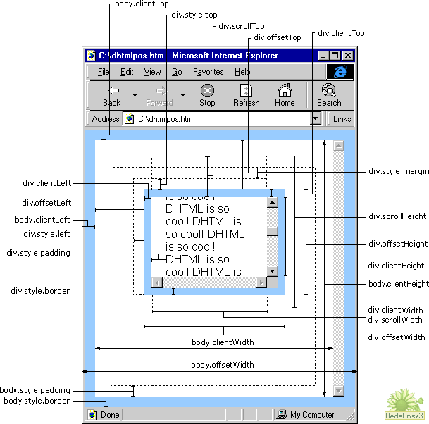

#### node operate

```js
// 获得所有class为epic的节点并遍历
let node = document.querySelectorAll('epic').forEach()

// 获得节点的class属性
node.getAttribute('class') // => epic

// 设置节点的class属性

node.setAttribute('class', 'epic2')


```


#### Dom 节点属性 

| Dom node attribute | Intro                                  | demo                                                         |
| ------------------------ | -------------------------------------- | ------------------------------------------------------------ |
| someNode.nodeType        | 节点类型（1 - 12）                     |                                                              |
| someNode.nodeName        | 节点标签名                             | 'p', 'div'                                                   |
| someNode.nodeValue       | 节点值                                 |                                                              |
| someNode.childNodes      | 节点的子节点类数组，保存着一个nodeList | someNode.childNodes[0]<br>someNode.childNodes.item(1)<br>Array.prototype.slice.call(childNodes, 0) |
| someNode.hasChildNodes() | 子节点是否含有childNodes | someNode.childNodes.length === 0 |
| someNode.parentNode      | 节点的父节点，所有子节点拥有同一父节点 |                                                              |
| someNode.previousSibling | 节点的兄弟节点（相邻的上一个节点）     |                                                              |
| someNode.nextSibling     | 节点的兄弟节点（相邻的下一个节点）     |                                                              |
| someNode.firstChild | 节点的第一个子节点 |                                                              |
| someNode.lastChild | 节点的最后一个子节点 | |


#### dom 操作

| Dom node operator           | Intro                                                        | Demo                                                         |
| --------------------------- | ------------------------------------------------------------ | ------------------------------------------------------------ |
| someNode.appendChild(A)     | 在someNode的nodeList末尾添加一个A                            |                                                              |
| someNode.insertBefore(A, B) | 在参照节点（B）前添加一个A 节点, 若第二个参数是 null , 则执行与 appendChild 相同操作 |                                                              |
| someNode.replaceChild(A, B) | 用B节点替换 A节点，B为someNode的子节点                       | someNode.replaceChild(node, someNode.firstChild)             |
| someNode.removeChild(A)     | 移除someNode下的某个子节点A                                  | A.removeChild(A.firstChild)                                  |
| someNode.cloneNode(boolean) | 复制节点 ，boolean 为 true 执行深复制， boolean 为 false 执行浅复制(只复制当前元素，不复制子元素)。执行复制之后的节点没有父节点，成了孤儿，必须通过以上集中操作才能显示。 | const deepNode  = someNode.cloneNode(true)  deepNode.length // 3                        const shallowNode = someNode.cloneNode(false)   shallowNode.length // 0 |
|                             |                                                              |                                                              |
|                             |                                                              |                                                              |
|                             |                                                              |                                                              |
|                             |                                                              |                                                              |


#### html translation

| 显示 | 说明           | 实体名称 | 实体编号 |
| ---- | -------------- | -------- | -------- |
|      | 半方大的空白   | & ensp; | &#8194;  |
|      | 全方大的空白   | & emsp; | &#8195;  |
|      | 不断行的空白格 | & nbsp; | &#160;   |
| <    | 小于           | & lt ; | &#60;    |
| >    | 大于           | & gt ;   | &#62;    |
| &    | &符号          | & amp ;  | &#38;    |
| "    | 双引号         | & quot;  | &#34;    |
| ©    | 版权           | & copy;  | &#169;   |
| ®    | 已注册商标     | & reg;   | &#174;   |
| ™    | 商标（美国）   | ™        | &#8482;  |
| ×    | 乘号           | & times; | &#215;   |
| ÷    | 除号           | & divide; | &#247;   |


####node size

1. window.innerHeight     // 浏览器视窗内高度（当前页面 ，不包括外层iframe）
2. window.innerWidth      // 浏览器内宽度
3. div.offsetHeight            // 元素在垂直方向占用的空间大小（单位-像素）
4. div.offsetWidth             // 元素在水平方向占用空间大小（单位-像素）
5. div.offsetLeft                 // 元素的左外边框至包含元素的左内边框之间的像素距离\
6. div.scrollLeft                  // 既可以确定元素当前滚动状态，又可以设置元素的**滚动位置**




