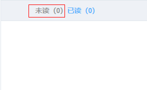

### elementUi

**el-table**`自定义表头jsx实现`



```vue
<template>
  <el-table>
    <el-table-column
    :render-header="renderHeader">
    </el-table-column>
  </el-table>
</template>
<script>
  export default {
    methods: {
      renderHeader() {
         return (<div class="readlist-table-header">
                    <a class={["readtab",{"active":!this.readStatus}]} 					                            href="javascript:void(0)" onClick={this.toUnread}>
                      未读（<span>{this.tData.unreadNum}</span>）
                    </a>
                    <a class={["readtab",{"active":this.readStatus}]}                                                href="javascript:void(0)" onClick={this.toUnread}>
                      已读（<span>{this.tData.readedNum}</span>）
                    </a>
                </div>);
      },
      toUnread() {
      	console.log(...)     
      }
    }
  }
</script>


```

