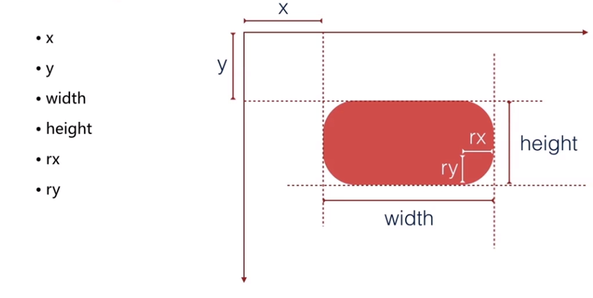
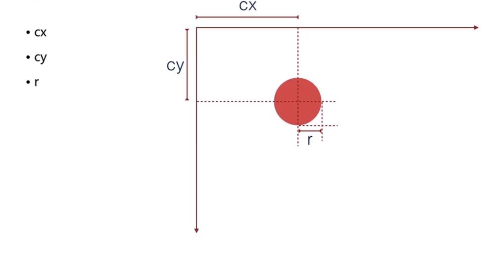
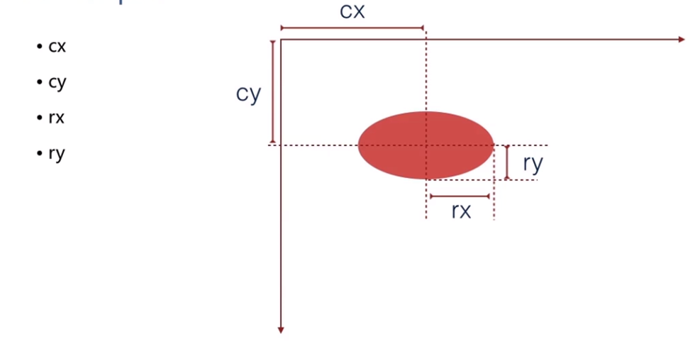
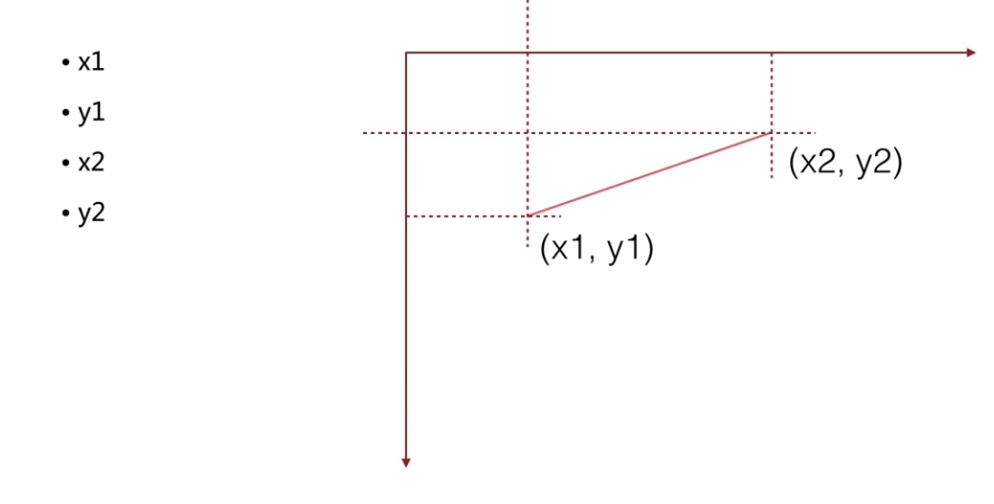
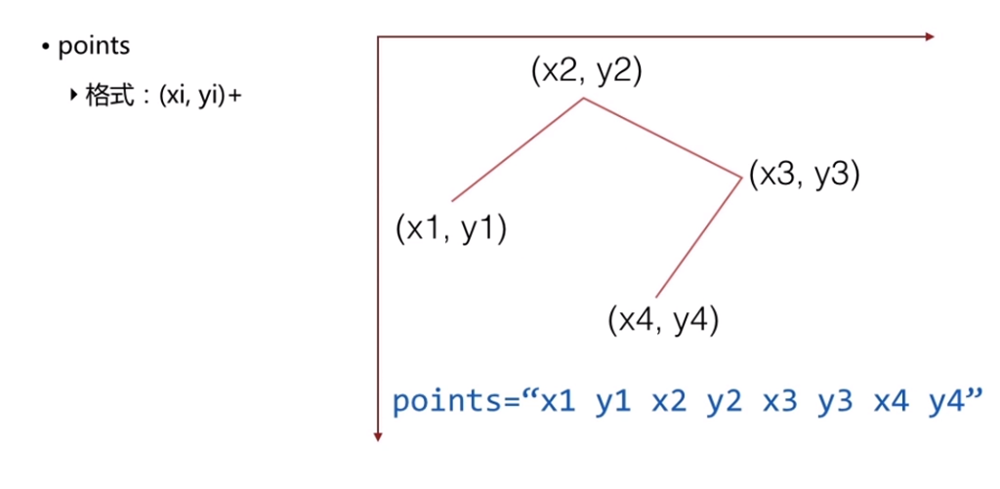
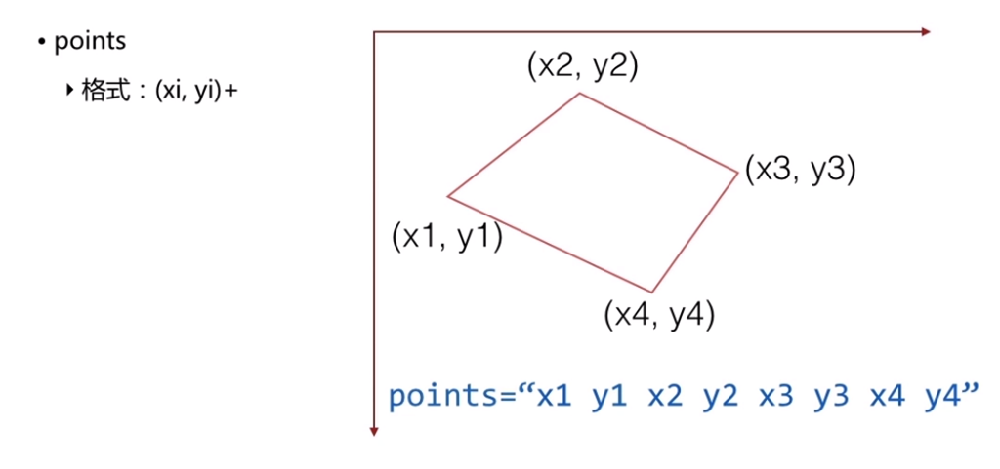

# Graphic

web前端常用图形处理


## 目录

[TOC]

## SVG

> 简介：基于xml的矢量图形描述文件


#### 展现方式

* 浏览器直接打开

* html中标签引用

* html中svg标签引入

* css的background引入

```html
   <!-- simple.svg -->
   <svg xmlns="http://www.w3.org/2000/svg" width="200" height="200">
     <circle cx="100" cy="100" r="90" fill="#777" />
     <circle cx="100" cy="100" r="50" fill="#000" />
     <path d="M 50 100 A 50 50 0 0 0 150 160" stroke="white" stroke-with="3" fill="none" />
   </svg>

   <!-- img -->
   

   <style>
     .svg {
       width: 200px;
       height: 200px;
       background: #07f url(simple.svg) repeat;
       fill: yellow; // 使用fill修改颜色而不是color
     }
   </style>
```


#### 基本元素

```html
<rect />     
<circle />   
<ellipse />
<line />

// 折线
<polyline />

// 多边形
<polygon />

// 任意路径
<path />  
```


#### 基本属性

fill,   stroke,   stroke-width,   transform


#### 基本图形样例

* **rect**

  ```html
  <rect x="50" y="50" width="200" height="200" rx="10" ry="30" />
  ```





* **circle**

  ```html
  <circle cx="50" cy="50" r="100" />
  ```





* **ellipse**

  ```html
  <ellipse cx="50" cy="50" rx="20" ry="40" />
  ```





* **line**

  ```html
  <line x1="0" y1="50" x2="87" y2="500" />
  ```





* **polyline**

  ```html
  <polyline points="30 20 100 500 30 89" />
  ```





* **polygon** 

  ```html
  <polygon points="20 20 30 58 59 59" />
  ```





## canvas

#### 绘制路径

```js
var ctx = canvas.getContext(‘2d’)   // 获取canvas2d上下文
canvas.getContext(‘webgl’)   //获取3d对象
ctx.beginPath()  //开始绘制路径   //ctx.closePath()   //连接起点终点
ctx.moveTo(x,y)  //设直线段的起点
ctx.lineTo(x,y)   //设置线段的终点
ctx.lineWidth = 1.0  //设直线段宽度
ctx.strokeStyle = ‘red’ //设直线段颜色
ctx.stroke() //绘制线段
```

#### 绘制矩形

```js
ctx.fillStyle = ‘yellow’   //填充色
ctx.fillRect(x,y,w,h)    //绘制实心矩形
ctx.strokeRect(x,y,w,h)   //绘制空心矩形
ctx.clearRect(x,y,w,h)    //清除矩形

```

#### 绘制文本

```js
ctx.font = ‘20px bold Arial’    //设置字体，大小
ctx.textAlign = ‘left’          //设置字体居中方式
ctx.fileText(text,x,y)				//绘制实心字体
ctx.strokeText(text,x,y)       //绘制空心字体

```

#### 绘制圆形和扇形

```js
//绘制扇形，anticlockwise 顺时针false，逆时针true，绘制扇形前需要调用beginPath方法
ctx.arc(x,y,r,startAngle,endAngle,anticlockwise)
```

#### 图像处理

```js
//绘制图像
ctx.drawImage(img,x,y[,width,height])      
ctx.getImageData(x,y,width,height)    

//获取图像信息imageData对象有一个data属性，它的值是一个一维数组。该数组的值，依次是每个像素的红、绿、蓝、alpha通道值，因此该数组的长度等于 图像的像素宽度 x 图像的像素高度 x 4，每个值的范围是0–255
ctx.putImageData(imgData,x,y)

```

#### 设置渐变色

```js
//x1,y1起点坐标 x2，y2 终点坐标
var gradient = ctx.createLinearGradient(x1, y1, x2, y2) 
gradient.addColorStop(0,color)
gradient.addColorStop(1,color)

 //创见圆形渐变
createRadialGradient(x1,y1,r1,x2,y2,r2)
```


## Icon图标引入方案

### svg

使用[icons8](https://icons8.cn/)生成整张svg图像 ，按生成页提示名称引入svg

优点：可以任意改变颜色，缩放不会模糊,经编译后无bug

```html
<!-- use 标签引入svg路径 -->
<i class="icon-2">
  <svg>
  	<use xlink:href=".../path/to/Default.min.svg#icon-2"></use>
  </svg>
</i>

<style>
  /* 改变大小和颜色 */
  .icon-2 {
    color: red；
    font-size: 24px；
  }
</style>

<!-- 单独使用构造svg -->
<svg 
  width="32px" 
  height="32px" 
  viewBox="0 0 32 32" 
  version="1.1"
  xmlns="http://www.w3.org/2000/svg">
  <path d="M24,10c0-1.657-1.343-3-3-3c-0.68,0-1.301,0.235-	1.804,0.617C18.467,6.641,17.312,6,16,6  s-2.467,0.641-3.196,1.617C12.301,7.235,11.68,7,11,7c-1.657,0-3,1.343-3,3H6v12h3v3.134C8.701,25.307,8.5,25.63,8.5,26  c0,0.552,0.447,1,1,1c0.841,0,1.5-0.682,1.5-1.552V22h1v3.134c-0.299,0.173-0.5,0.496-0.5,0.866c0,0.552,0.447,1,1,1  c0.841,0,1.5-0.682,1.5-1.552V22h4v3.134c-0.299,0.173-0.5,0.496-0.5,0.866c0,0.552,0.447,1,1,1c0.841,0,1.5-0.682,1.5-1.552V22h1  v3.134c-0.299,0.173-0.5,0.496-0.5,0.866c0,0.552,0.447,1,1,1c0.841,0,1.5-0.682,1.5-1.552V22h3V10H24z M24,20H8v-8h16V20z M15,16  c0-0.552,0.448-1,1-1s1,0.448,1,1c0,0.552-0.448,1-1,1S15,16.552,15,16z M19,16c0-0.552,0.448-1,1-1s1,0.448,1,1  c0,0.552-0.448,1-1,1S19,16.552,19,16z M11,16c0-0.552,0.448-1,1-1s1,0.448,1,1c0,0.552-0.448,1-1,1S11,16.552,11,16z" fill="currentColor">
  </path>
</svg>
```


### sprit图


## highCharts

> 图表绘制工具

```js
highCharts.chart(el,options);
var options = {
  chart: {
    type: 'spline',
    backgroundColor: '#031824',
  },
  title: {
    text: '付费用户情况',
    style: { color: '#fff' },
  },
  subtitle: {
    text: '',
  },
  xAxis: {
    type: 'datetime',       //类别  linear, logarithmic, datetime or categories
    dateTimeLabelFormats: { // don't display the dummy year
      month: '%e. %b',
      year: '%b',
    },
    title: {
      text: '',
      style: { color: '#fff' },
    },
  },
  yAxis: {
    title: {
      text: '',
    },
    min: 0,
    gridLineWidth: 1,    // 格子线宽度
    tickInterval: 0.5,   //y轴单位间隔
    dataLabels: {
      enabled: true,      //显示每一点的数据
    },
  },
  tooltip: {
    headerFormat: '<b>{series.name}</b><br>',
    pointFormat: '{point.x:%e. %b}: {point.y:.2f} m',
  },
  plotOptions: {
    spline: {
      marker: {
        enabled: true,
      },
    },
  },
  series: [{
    name: '付费用户',
    color: '#333',                                  //数据线条颜色
    allowPointSelect: true,                         //可选择此点
    lineWidth: 5,                                   //线条宽度
    data: [
      [Date.UTC(1970, 9, 21), 0],
      [Date.UTC(1970, 10, 4), 0.28],
      [Date.UTC(1970, 10, 9), 0.25],
      [Date.UTC(1970, 10, 27), 0.2],
      [Date.UTC(1970, 11, 2), 0.28],
      [Date.UTC(1970, 11, 26), 0.28],
      [Date.UTC(1970, 11, 29), 0.47],
      [Date.UTC(1971, 0, 11), 0.79],
      [Date.UTC(1971, 0, 26), 0.72],
      [Date.UTC(1971, 1, 3), 1.02],
      [Date.UTC(1971, 1, 11), 1.12],
      [Date.UTC(1971, 1, 25), 1.2],
      [Date.UTC(1971, 2, 11), 1.18],
      [Date.UTC(1971, 3, 11), 1.19],
      [Date.UTC(1971, 4, 1), 1.85],
      [Date.UTC(1971, 4, 5), 2.22],
      [Date.UTC(1971, 4, 19), 1.15],
      [Date.UTC(1971, 5, 3), 0],
    ],
  }, {
    name: '免费用户',
    data: [
      [Date.UTC(1970, 9, 29), 0],
      [Date.UTC(1970, 10, 9), 0.4],
      [Date.UTC(1970, 11, 1), 0.25],
      [Date.UTC(1971, 0, 1), 1.66],
      [Date.UTC(1971, 0, 10), 1.8],
      [Date.UTC(1971, 1, 19), 1.76],
      [Date.UTC(1971, 2, 25), 2.62],
      [Date.UTC(1971, 3, 19), 2.41],
      [Date.UTC(1971, 3, 30), 2.05],
      [Date.UTC(1971, 4, 14), 1.7],
      [Date.UTC(1971, 4, 24), 1.1],
      [Date.UTC(1971, 5, 10), 0],
    ],
  }, {
    name: '总用户',
    data: [
      [Date.UTC(1970, 10, 25), 0],
      [Date.UTC(1970, 11, 6), 0.25],
      [Date.UTC(1970, 11, 20), 1.41],
      [Date.UTC(1970, 11, 25), 1.64],
      [Date.UTC(1971, 0, 4), 1.6],
      [Date.UTC(1971, 0, 17), 2.55],
      [Date.UTC(1971, 0, 24), 2.62],
      [Date.UTC(1971, 1, 4), 2.5],
      [Date.UTC(1971, 1, 14), 2.42],
      [Date.UTC(1971, 2, 6), 2.74],
      [Date.UTC(1971, 2, 14), 2.62],
      [Date.UTC(1971, 2, 24), 2.6],
      [Date.UTC(1971, 3, 2), 2.81],
      [Date.UTC(1971, 3, 12), 2.63],
      [Date.UTC(1971, 3, 28), 2.77],
      [Date.UTC(1971, 4, 5), 2.68],
      [Date.UTC(1971, 4, 10), 2.56],
      [Date.UTC(1971, 4, 15), 2.39],
      [Date.UTC(1971, 4, 20), 2.3],
      [Date.UTC(1971, 5, 5), 2],
      [Date.UTC(1971, 5, 10), 1.85],
      [Date.UTC(1971, 5, 15), 1.49],
      [Date.UTC(1971, 5, 23), 1.08],
    ],
  }],
};

```

