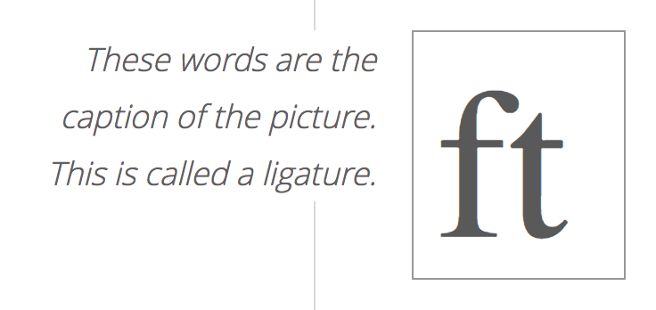

# html

> html总结


### 目录

[TOC]

### html 组件

* **html imports**

  > 状态, 草案
  >
  > 垫片方案   引用google 的 webcomponents.js

  ```shell
  <link rel="imports" href="myFile.html" />
  ```


### html标签

* **figure**

  ```html
  <figure>
      <figcaption>These words are the caption of the picture. This is called a
          ligature.</figcaption>
      
  </figure>
  ```

look like this 

------


* **a 标签跳转**

   ```html
   <!-- 相同页面跳转 -->
   <a href="#my-place"></a>
   ...
   <div id="my-place">
       
   </div>
   
   <!-- 不同页面跳转 -->
   <a href="space.html#my-place"></a>
   ```

* **a标签下载**

   ```html
   <a download="file_name" href="file_path">download</a>
   ```

* **a标签target**

   ```html
   <a src="test.html" target="custom-iframe">点击设定iframe链接</a>
   <iframe id="custom-iframe">
       
   </iframe>
   ```


### 移动端开发标签

* **meta**

  - viewport `minimal-ui`  最小化ui及使浏览器导航栏默认不显示
  - screen-orientation `portrait` 强制竖屏显示
  - format-detection `telephone=no` 手机号码不被显示为拨号连接

  ```html
  <!DOCTYPE html>
  <html>
    <head>
      <meta 
         name="viewport" content="user-scalable=no, width=device-width, 
         initial-scale=1.0, maximum-scale=1.0, minimum-scale=1.0, minimal-ui"/>
      <meta name="screen-orientation" content="portrait"/>
      <meta name="format-detection" content="telephone=no" />
    </head>
    <body>
    </body>
  </html>
  ```


### Html 模版


#### pug(jade)

> html 模板引擎，可以配合express koa做服务端渲染 

> [pug在线文档](https://pugjs.org/language/attributes.html) 

* **属性**

  ```jade
  a(href='www.bing.com',class='myClass') hello
  //- （）括号内普通属性属性之间空格或逗号, 空格后标签文字
  
  - var flag = true
  span(class=flag ? 'light' : 'dark')
  //- 变量表达式 - 之后
  ```


