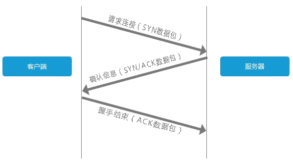
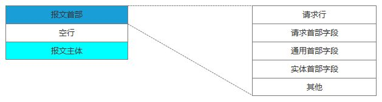
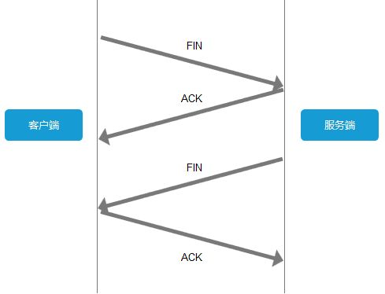

# interview

> 收录了经典前端面试题和解答


### 目录

[TOC]


### 优质网站

- https://blog.csdn.net/kongjiea/article/details/46341575
- https://segmentfault.com/a/1190000000465431
- http://www.cnblogs.com/syfwhu/p/4434132.html


### 术语

#### xss 和 csrf区别

- **csrf (Cross-site request forgery)** 

  跨站请求伪造， 攻击者盗用了你的身份，以你的名义发送恶意请求 。

  条件

  1.登录受信任网站A，并在本地生成Cookie。

  2.在不登出A的情况下，访问危险网站B。

  

- **xss （Cross-site scripting）**

  * 分类

    1.持久型（永久上传某段代码，之后的所有用户都会被攻击）

    2.非持久型（让某个用户点击恶意代码片段连接，只对这个用户攻击）恶意代码注入，将恶意代码片段通过任何途径上传到服务器端，当下次用户进行访问时就会执行恶意代码

  * 防御

    1.过滤用户输入，谨慎存取
    2.对用户输入进行转码


#### http 和 https 的区别

* http默认端口80，https默认端口443

* https采用ssl加密，http无加密

* https的web服务器启用ssl需要获得一个服务器证书，并将该证书与要使用ssl的服务器绑定


#### 懒加载（load on demand)

懒加载或者按需加载，是一种很好的优化网页或应用的方式。这种方式实际上是先把你的代码在一些逻辑断点处分离开，然后在一些代码块中完成某些操作后，立即引用或即将引用另外一些新的代码块

```js
// 1.webpack 使用promise和async函数实现 懒加载

// 2.vue 使用 import 函数
Vue.component('AsyncCmp', () => import('./AsyncCmp'))

// 3.react 与 vue 类似
const LoadableComponent = Loadable({
  loader: () => import('./Dashboard'),
  loading: Loading,
})

export default class LoadableDashboard extends React.Component {
  render() {
    return <LoadableComponent />;
  }
}

// 图片懒加载  标签不要设置src属性，放在自定义属性中，根据window.scrollTop判断图片是否出现在用户视野中，如果出现 将自定义属性中的 url 放入src属性中
```


------

#### 浏览器在输入url敲回车后发生了什么

* **步骤**

  1.DNS域名解析；
  2.建立TCP连接；
  3.发送HTTP请求；
  4.服务器处理请求；
  5.返回响应结果；
  6.关闭TCP连接；
  7.浏览器解析HTML；
  8.浏览器布局渲染；


* **步骤详解**
  * **建立tcp连接**



​	

* **发送http请求**​	



* **关闭tcp连接**





* **浏览器解析html**

  浏览器需要加载解析的不仅仅是HTML，还包括CSS、JS。以及还要加载图片、视频等其他媒体资源。

  浏览器通过解析HTML，生成DOM树，解析CSS，生成CSS规则树，然后通过DOM树和CSS规则树生成渲染树。渲染树与DOM树不同，渲染树中并没有head、display为none等不必显示的节点。

  要注意的是，浏览器的解析过程并非是串连进行的，比如在解析CSS的同时，可以继续加载解析HTML，但在解析执行JS脚本时，会停止解析后续HTML，这就会出现阻塞问题。

* **浏览器布局渲染**

根据渲染树布局，计算CSS样式，即每个节点在页面中的大小和位置等几何信息。HTML默认是流式布局的，CSS和js会打破这种布局，改变DOM的外观样式以及大小和位置。这时就要提到两个重要概念：replaint和reflow。

> replaint：屏幕的一部分重画，不影响整体布局，比如某个CSS的背景色变了，但元素的几何尺寸和位置不变。
> reflow： 意味着元件的几何尺寸变了，我们需要重新验证并计算渲染树。是渲染树的一部分或全部发生了变化。这就是Reflow，或是Layout。

所以我们应该尽量减少reflow和replaint，我想这也是为什么现在很少有用table布局的原因之一。

最后浏览器绘制各个节点，将页面展示给用户。


### 高级问题


#### 分析双向数据绑定的原理，并用简单的代码实现

```js

function Vue(options) {
  this.$init(options);
}
Vue.prototype.$init = function(options = {}) {
  let data = this._data = options.data || {}
  let self = this
  let dep = new Dep()
  // 属性代理 vm.a === vm.data.a
  Object.keys(data).forEach((key, index) => {
    Object.defineProperty(self, key, {
      configurable: true,
      enumerable: true,
      get(){
        return data[key]
        dep.depend()
      },
      set(val) {
        data[key] = val
        dep.notice() 
      }
    })
  })
}

function Dep() {
  // 
}
Dep.prototype.notice = function() {
  // 触发页面更新
}
Dep.prototype.depend = function() {
  // 关联当前所有数据和watcher的关系
}

let vm = new Vue({data: {a: 1, b: 2}})


console.log(vm.a === vm._data.a) // 实例访问数据
vm.a = 3
console.log(vm._data.a)
```


#### 手动封装一个promise库，能实现基本的promise api。


#### js实现快速排序（前端常见算法举例说明）


#### 实现深度拷贝

```js
function clone(obj) {
    if (obj instanceof Array) {
        let ret = []
        obj.forEach((item, index) => {
            ret[index] = clone(item)
        })
        return ret
    } else if (obj intanceof Object) {
        let ret = {}
        Object.keys(ret).forEach((item, index) => {
            ret[item] = clone(obj[item])
        })
        return ret
    } else {
        return obj
    }
}
```

