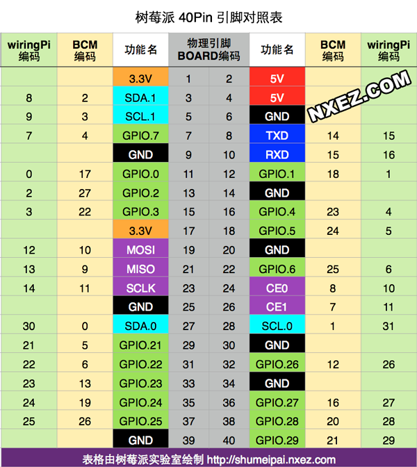

### 系统设置

**App软件源**

文件位置    /etc/apt/sources.list

**Ip地址**

//ip   192.168.17.149

wlan  192.168.41.89

**Mjpg-streamer  使用**

```shell
 ./mjpg_streamer -i "./input_uvc.so -d /dev/video0 -n -y -f 25 -r 640x480" -o "./output_http.so -n -w /usr/local/www"
```

访问：http://localhost:8080/?action=stream


**改变文件权限**

```shell 
chmod 751 file 
```

三个数字从左到右（用户，用户组，其它成员） 4：读取，2：写入，1：执行【7 = 所有权限】


**把可执行文件设为全局命令**

```shell
ln -s name /usr/local/bin/name
```


**boot设置**

```shell
sudo raspi-config
```


wringPi  1  引脚可以设置为servo模式
new five.Pin({pin:1,mode:4})

**wifi 设置**

```shell
//搜索附近wifi
iwlist scan    

//编辑文件设置密码
sudo vim /etc/wpa_supplicant/wpa_supplicant.conf   
```


**windows 环境变量设置**
set    //显示全部环境变量
set Path=...  //设置环境变量path


**linux 显示环境变量**
env


**查看端口占用情况**
netstat


#### mac os ssh 连接树莓派

```shell
$ ssh pi@192.168.17.149
```


#### 我的树莓派设置

vnc 密码 12341234


**wiringPi引脚定义，图例如下**



### fritizing 使用说明

[资源库](http://forum.fritzing.org/c/parts-submit/l/top)

