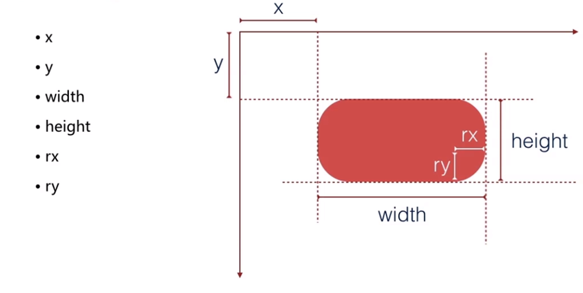
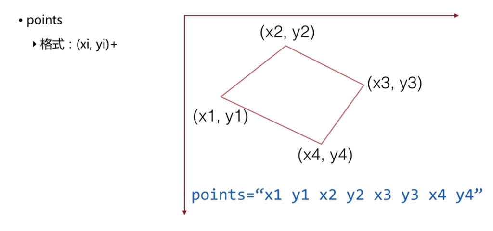

### svg  ### 

简介：基于xml的矢量图形描述文件

------

**展现方式**

1. 浏览器直接打开

2. html中标签引用

3. html中svg标签引入

4. css的background引入

```html
   <!-- simple.svg -->
   <svg xmlns="http://www.w3.org/2000/svg" width="200" height="200">
     <circle cx="100" cy="100" r="90" fill="#777" />
     <circle cx="100" cy="100" r="50" fill="#000" />
     <path d="M 50 100 A 50 50 0 0 0 150 160" stroke="white" stroke-with="3" fill="none" />
   </svg>

   <!-- img -->
   

   <style>
     .svg {
       width: 200px;
       height: 200px;
       background: #07f url(simple.svg) repeat;
     }
   </style>
```

**基本元素**

```html
<rect />     
<circle />   
<ellipse />
<line />

// 折线
<polyline />

// 多边形
<polygon />

// 任意路径
<path />  
```

**基本属性**

fill,   stroke,   stroke-width,   transform

**基本图形样例**

1. rect



```html
<rect x="50" y="50" width="200" height="200" rx="10" ry="30" />
```

2. circle

   

```html
<circle cx="50" cy="50" r="100" />
```

3.ellipse


```html
<ellipse cx="50" cy="50" rx="20" ry="40" />
```


4. line


```html
<line x1="0" y1="50" x2="87" y2="500" />
```

5. polyline

   

   ```html
   <polyline points="30 20 100 500 30 89" />
   ```

   6. polygon 

      

      ```html
      <polygon points="20 20 30 58 59 59" />
      ```

      ​

