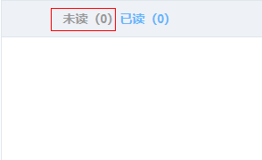

## vue record

**vue cli**

```js
vue list // 列出所有可用脚手架
vue init webpack demo // 创建以webpack为脚手架名为demo的项目
```

**vue 入口文件属性**

```js
/* ----------- main.js  ------------------ */
import App from './App'
new Vue({
  el: '#app',
  router,
  store,
  components: { App },
  template: '<App/>'
})


// 与上面写法等效 (使用render函数)
new Vue({
  el: '#app',
  router,
  store,
  render: h => h(App)
})


```

**vue 指令**

```js
/* --------------------------------注册指令-------------------- */
//全局注册
Vue.directive(‘directiveName’,{
  	bind: function (el,binding) {
    	//binding.value 指绑定的值
  	},
  	inserted: function () {},
  	update: function () {},
  	componentUpdated: function () {},
 	unbind: function () {}

});
//组建内注册
export default {
  directives: {
    directiveName: {
      bind() {} .....//一系列钩子函数
    }
  }
}

```

**vue 样式**

```html
<!-- 样式引入-->
<style lang="less" scoped>
	@import './demo.less'
</style>

<div :class="{classOne: true, classTwo: true}"
     :style="{color: 'red', fontSize: '12px', 'background-color': 'red'}">
</div>

```

```js
/* --------------header 高度为100,动态设置main容器高度 --------- */
let timer;
export default {
  data() {
    return { mainHeight: 0 }
  },
  created() {
    window.addEventListener('resize', () => {
      if (timer) {
        cleartTimeout(timer)
      }
      else {
        timer = setTimeout(() => {
       		this.mainHeight = window.innerHeight - 100;   
        })
      }
    })
  },
}
```

**vue 异步组件**

```js
/* ---------------异步引入模块 ------------ */
// 写法一
const component = () => import('componentName')  

// 写法二
const component = resolve => require(['componentName'],resolve)
```

**vue 渲染组建（createElement函数）**

```html
<custom-component>
  <p slot="header">
    这里是头部内容
  </p>
  <p>
    这里是默认slot内容
  </p>
  <p slot="footer">
    这里是底部内容
  </p>
</custom-component>
```

```js
// render 函数
Vue.component('customComponent', {
  render(h) {
    let hearder = this.$slot.header;
    let main = this.$slot.default;
    let footer = this.$slot.footer;
    return h('div', [
      h('header', header),
      h('main', main),
      h('footer', footer),
    ])
  }
})
```

**vue 渲染组建（jsx）**

- {value} 单花括号变量名

```jsx
new Vue({
  el: '#demo',
  props: ['name','imgSrc'],
  methods: {
    handleImgClick() {
      console.log('awesome picture')
    }
  },
  render(h) {  
    return (
    	<div 
          level={1} 
          name={this.name} 
          class={{ foo: true, bar: false }}
      	  style={{ color: 'red', fontSize: '14px' }}>
        	
      	</div>
    )
  }
})
```


**Vue 选项**

```js
// watch 深度观察, *注: 观察数组时不需要deep，但是arr[1] = 1,赋值操作不会触发观察,方法操作才会触发例如arr.splice(0, 1, 1)
watch: {
  c: {
      handler: function (val, oldVal) { /* ... */ },
      deep: true
    }
}
```


**service**分离请求(太多ajax太丑陋，封装成单个js暴露出去，每个方法均返回promise实例)

```js
// index.js
import Vue from 'vue'
import VueResource from 'vue-resource'
Vue.use(VueResource)

// 小 service模块
import login from './login' 
import cart from '.cart'

export default {
  login,
  cart,
}

// cart.js
import Vue from 'vue'
export default {
  getProductsById(id) {
    return Vue.http.get('url', {params: {id}})
  }
}
```


**Vue-axios**

```js
//挂载请求拦截器
var ajax = axios.interceptors.request.use(function (config) {
    // 对请求进行设置（格式。。。）返回config
   	if (config.method === 'post') {
      newConf.headers['Content-Type'] = 'application/x-www-form-urlencoded';
    }
    return config;
}, function (error) {
    // 失败操作
  	alert('操作失败')
    return Promise.reject(error);
});

//取消拦截器
axios.interceptors.request.eject(interceptor)

/* ------------------- 相应拦截器，可处理失败响应等等 --------------------- */
axios.interceptors.response.use(function (response) {
    //根据响应状态吗判断
  	if (response.status !== 200) {
      alert('服务器异常');
      return Promise.reject(response);
    } 
  	//根据响应返回信息判断
  	else if (response.data.ret !== 0) {
      alert(ERR_CODE[response.data.ret] || '操作失败');
      //返回失败态promise
      return Promise.reject(response.data.ret_msg);
    }
    return response;
}, function (error) {
    // 错误处理
    return Promise.reject(error);
});

/* ------------------ Promise.all应用(多项操作，但接口不支持多个) --------------------- */

{
  arr: [1,2,4,5]
  getById(id) {
    // service接口请求，返回promise实例
    return this.service.getById(id)
  }
  getByIds() {
    new Promise.all(this.arr.map(item => this.getById(item))).then(results => {
      this.getList()
    }).catch((err) => {
      alert('请求出错')
    })
  }
}
```


**vue 其它**

```js
/* --------------------返回当前route路径 ------------------ */
computed() { 
  return this.$route.path
}


/* ----------单独引用element 组件使用方法------- */
import { MessageBox } from 'element-ui'
//单独调用
MessageBox.alert(msg,title,{type:'error'});
//挂载后调用
this.$alert(msg,title,{type:'error'});


/*---------------动态组建 (可用于一个页面有多个弹窗)----------------------*/
v-bind:is=”componentName”
<component :is=”currentView”></component>
```


### elementUi

**el-table**`自定义表头jsx实现`



```vue
<template>
  <el-table>
    <el-table-column
    :render-header="renderHeader">
    </el-table-column>
  </el-table>
</template>
<script>
  export default {
    methods: {
      renderHeader() {
         return (<div class="readlist-table-header">
                    <a class={["readtab",{"active":!this.readStatus}]} 					                            href="javascript:void(0)" onClick={this.toUnread}>
                      未读（<span>{this.tData.unreadNum}</span>）
                    </a>
                    <a class={["readtab",{"active":this.readStatus}]}                                                href="javascript:void(0)" onClick={this.toUnread}>
                      已读（<span>{this.tData.readedNum}</span>）
                    </a>
                </div>);
      },
      toUnread() {
      	console.log(...)     
      }
    }
  }
</script>


```

